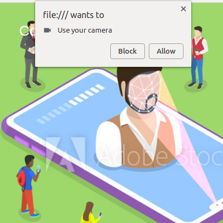

<h1>ComputerVision</h1>

With the help of AI, machines now also have senses and they can work with the help of taking signals via these senses. Image recognition is one of its senses. Here is a collection of some cool projects which incorporates the image recognising power of computer and help you do creative things.

Click allow when browser ask for camera permissions.

 
One of the project is based on Tensorflow.js posnet. Enjoy seeing your skeletal copy you, while you move.

